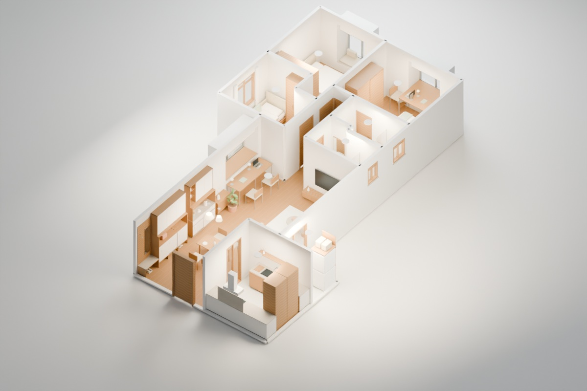

# 木光之间 · 荟雅苑的家

104.83㎡ / 28F / 三房两卫。按照原户型重建的现代原木设计：Blender 源模型、真实模型渲染和 Three.js 交互网站使用同一套几何数据。

**在线查看：[itwake.github.io/house-design](https://itwake.github.io/house-design/)**



## 这一版有什么

- 温暖的浅橡木、暖白、亚麻与石材配色，细化家具、灯具、柜体和生活用品。
- 全屋立体浏览、逐房镜头、平面核对、墙体剖切、尺寸与房间标签。
- 全屋、客厅、餐厅、主卧、次卧B、书房兼客卧C、厨房、主卫、客卫、生活阳台共10个 Blender 渲染视角。
- 三处功能飘窗：主卧一体办公梳妆台及单椅、次卧无独立桌椅的单人茶座、客厅双人学习桌，另有3张细节渲染；网页可展开尺寸、代价、使用条件与原始案例链接。
- 玄关鞋柜、短换鞋凳与餐边收纳专项：奶白门板、浅木留空格、滑门及干式饮品台；两张柜体近景和网络案例链接。
- 可下载 `.blend` 源文件及带贴图的 `.glb` 模型。
- 低负载按需绘制；不支持 WebGL 时仍可看平面与效果图。

效果图由实际模型直接渲染，不使用生成式图片重新解释空间。模型适用于方案讨论，**不是施工图，也不是现场实测成果**。

## 设计与几何修正

V3.0.6依据设计师原作、业主日记与品牌方案图，重做玄关鞋柜与餐边柜。鞋柜1750×400×2500mm，末端换鞋凳800×400、坐高450mm；餐边柜1400×400、台高850mm，配280mm深上柜。餐桌和四椅东移400、北移400mm，吊灯同步，改善旧柜前仅425mm的限制。尺寸均待复尺，详情及来源见[玄关与餐边柜专项](docs/entry-storage-design-v306.md)。

拆除出租隔出的第四间房，恢复客餐厅。客厅电视在双卫南侧实墙，保留西侧窗；主卧与次卧采用真实家具占地，书房兼第三卧室。两个小卫生间按紧凑洁具与固定淋浴玻璃组织，不虚构宽敞空间。

V3.0.3恢复两卫阶梯共墙与客卫西北盆位，主卫改为从主卧进入。主卧床头朝东、次卧B朝西，并同步移动衣柜及洁具；此前恢复的三处飘窗和书房南墙继续保留。阳台新门标为拟改造；原门改窗的具体边界待确认，不作为已核实原结构。

V3.0.5按用户反馈取消主卧独立桌，只保留**一体飘窗办公梳妆台和一把配椅**；次卧删除独立书桌、书椅，保留茶座。主卧台面跨飘窗及室内，腿位不借实台；为侧向入座，床向南移220mm、衣柜南移250mm，床头仍朝东。保留旧900mm未实测台高时，示意为931mm高台配640mm座高和足踏，并非普通750mm桌或已验证的全天办公位。详见[本次调整说明](docs/bay-window-design-v305.md)。

三处延续V3.0.4网络案例启发的暖灰细框、无绳卷帘与浅木功能件。客厅2000×650mm桌不变；次卧仍是**430mm实台＋50mm垫的条件茶座**：旧900mm从未实测，不能据此降台、拆台或认为可坐。所有窗台高度、结构、入座与防坠须现场核验。

28楼窗边桌椅/坐垫会增加攀爬风险。窗防护、限位、玻璃、可开启扇、结构承载及儿童身高适配必须先深化；渲染里的普通玻璃不代表防坠已通过。设计依据与落地条件见 [三飘窗设计说明](docs/bay-window-design-v304.md)。

详细证据、尺寸等级及尚未确定的事项见 [几何校核记录](docs/geometry-v3.md)。

渲染中发现的问题、修正和网页检查范围见 [V3检查记录](docs/qa-v3.md)。

## 尺寸边界

已知图纸锚点：北侧总宽6870mm、全长14010mm、南侧下部总宽6410mm。数据内部单位为厘米；Blender使用米，坐标映射为 `(x/100, -y/100, z)`，glTF导出后为Y轴向上。

墙厚120mm、层高2700mm，以及部分门窗尺寸、窗台高度与凹口位置是待复尺的建模假设。模型室内区域合计约78.82㎡，不能作为产权套内面积或得房率结论。阳台外侧开口和厨房外窗证据不足，不作已核实结构展示；梁、柱、烟道、立管和承重属性仍需现场调查。

## 文件

| 文件 | 用途 |
|---|---|
| `models/design-data.json` | 新版墙线、房间、家具的共用坐标 |
| `models/blender-overrides.json` | 修正后的门窗开口定义 |
| `tools/build_blender.py` | 参数化建模、贴图、导出及渲染 |
| `models/huiyayuan-wood.blend` | Blender源模型，内嵌贴图与相机 |
| `models/huiyayuan-wood.glb` | 网页使用的3D模型 |
| `models/scene-manifest.json` | 房间、相机与效果图索引 |
| `assets/blender-renders/` | 10张全屋/空间渲染及3张飘窗细节渲染 |
| `models/design-data.json` 内 `bayFitouts` | 每件桌面、支架、椅、坐垫与茶托的共享三维包围盒 |
| `studio.js` / `studio.css` | Three.js交互与页面样式 |
| `legacy.html` | 已标记局限的旧版归档，不作新版几何依据 |

## 本地运行

```powershell
python -m http.server 8080
```

访问 `http://localhost:8080/`。不能直接双击HTML使用模型加载器。

## 重建与验证

使用 Blender 4.5 LTS（构建环境为4.5.9），将 `blender` 替换为实际程序路径：

```powershell
blender --background --threads 2 --python tools/build_blender.py -- --only-build
blender --background models/huiyayuan-wood.blend --threads 2 --python tools/build_blender.py -- --reuse --render all --samples 32 --resolution 1600
python tools/validate_studio.py --assets
node tools/test_plan_geometry.mjs
node --check studio.js
```

渲染默认使用 Cycles CPU 与去噪。可用 `--render overall,living` 仅渲染选定镜头。修改几何或相机后必须重新构建，不能仅 `--reuse`。

网页交付图为1200×800像素、Cycles 16采样加去噪。上面的32采样/1600像素命令可用于更高质量导出。浏览器复测可使用 `tools/qa_studio.mjs`（传入本机调试端口和本项目标签页ID），会记录运行异常、移动端溢出并保存截图到被Git忽略的`tmp/`。

`test_plan_geometry.mjs`直接运行网页的平面绘制函数，核对床架/床垫/头板、阶梯双卫、套卫门、飘窗与盆柜方向。发布后可运行 `node tools/verify_published.mjs 本机CDP端口 项目标签页ID`，检查Pages资源以及线上模型和本地GLB的SHA一致性；仅接受本项目的已发布标签页。

`validate_bay_fitouts.py`由主校验器调用，检查15个飘窗部件的实际GLB包围盒、支架三角网格的膝脚净空与条件元数据。`node tools/qa_bay_ui.mjs 本机CDP端口 本地项目标签页ID --images`可重复运行三方案的桌面/手机专题、图片、参考链接及SVG导出检查（不实际访问参考链接或下载文件）。

## 历史版本与许可

旧版 Sweet Home 3D 文件和概念图保留供追溯；其中部分AI概念图曾误读空间与窗口，不能用于施工或新版几何核对。新版改为实际 Blender 渲染。

Three.js采用MIT许可；Blender用于离线制作，不打包进网站。更多信息见 [THIRD_PARTY_NOTICES.md](THIRD_PARTY_NOTICES.md)。
